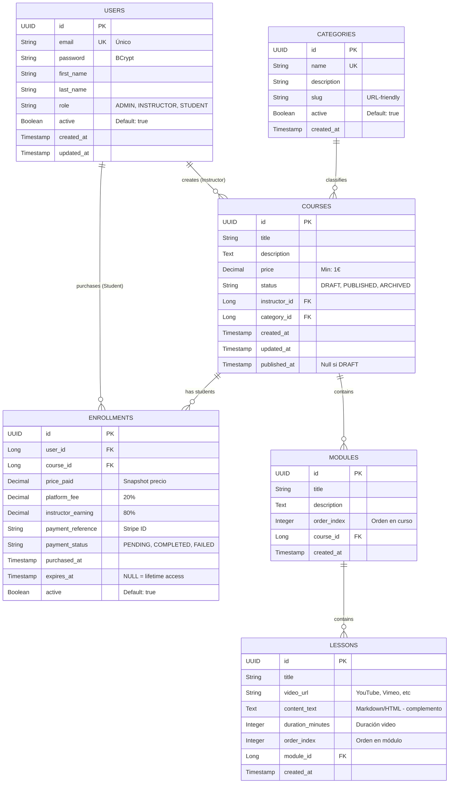

# FUNCTIONAL REQUIREMENTS - E-Learning Platform (Hexagonal Architecture)

## Índice
1. [Visión General](#1-visión-general)
2. [Modelo de Negocio](#2-modelo-de-negocio)
3. [Actores y Roles](#3-actores-y-roles)
4. [Modelo de Datos](#4-modelo-de-datos)
5. [Reglas de Dominio](#5-reglas-de-dominio)
6. [Casos de Uso Core](#6-casos-de-uso-core)
7. [Endpoints REST](#7-endpoints-rest)
8. [Arquitectura Hexagonal](#8-arquitectura-hexagonal)
9. [Mensajería (RabbitMQ)](#9-mensajería-rabbitmq)
10. [Roadmap de Desarrollo](#10-roadmap-de-desarrollo)
11. [Stack Técnico](#11-stack-técnico)

---

## 1. Visión General

Plataforma MVP de venta y consumo de cursos online construida bajo **Arquitectura Hexagonal**.

**Objetivo de aprendizaje**: Dominar los principios de puertos y adaptadores, separación de capas, y dependencias invertidas.

**Flujo de negocio principal**:
1. Instructor crea curso (DRAFT) → Publica curso (PUBLISHED)
2. Student compra curso → Recibe acceso
3. Student consume lecciones (video + texto complementario)

**Fuera de scope (v1)**:
- Suscripciones premium
- Sistema de ratings/reviews
- Certificados de completitud
- Tracking de progreso
- Bundles de cursos

---

## 2. Modelo de Negocio

### Comisiones
- **Plataforma**: 20% por venta
- **Instructor**: 80% por venta

### Precios
- **Mínimo por curso**: 1€ o 1 USD
- Los precios se almacenan como snapshot en cada compra (histórico)

### Expiración de acceso
- **Por defecto**: Acceso de por vida
- **Opcional**: Cursos con fecha de expiración (ej: acceso por 6 meses)

---

## 3. Actores y Roles

El sistema usa **RBAC (Role-Based Access Control)** con un solo rol por usuario.

| Rol | Descripción | Permisos Clave |
|-----|-------------|----------------|
| **ADMIN** | Superusuario | Gestionar usuarios, archivar cursos, aprobar publicaciones manualmente, gestionar categorías |
| **INSTRUCTOR** | Creador de contenido | Crear/Editar cursos propios, puede comprar cursos de otros |
| **STUDENT** | Cliente final | Comprar cursos, consumir contenido comprado |

### Matriz de Permisos

| Acción | ADMIN | INSTRUCTOR | STUDENT |
|--------|-------|------------|---------|
| Crear curso | ❌ | ✅ (propios) | ❌ |
| Editar curso | ❌ | ✅ (propios) | ❌ |
| Archivar curso | ✅ (cualquiera) | ❌ | ❌ |
| Comprar curso | ✅ | ✅ | ✅ |
| Consumir contenido | ✅ | ✅ (comprados) | ✅ (comprados) |
| Gestionar usuarios | ✅ | ❌ | ❌ |

**Nota**: Un usuario puede ser INSTRUCTOR y comprar cursos de otros instructores.

---

## 4. Modelo de Datos

**Tecnología**: H2 (desarrollo) → PostgreSQL (producción)

### Diagrama Entidad-Relación



### Datos Iniciales (Seed Data)

**Usuario Admin**:
```
email: admin@elearning.com
password: Admin123!
role: ADMIN
```

**Categorías iniciales**:
- Programming & Development
- Web Development
- Data Science & AI
- Design & UX

---

## 5. Reglas de Dominio

**CRÍTICO**: Define dónde vive cada regla de negocio (Domain Model vs Use Case).

### 5.1. Usuario (Domain Model: User)

**Validaciones que viven en el modelo de dominio**:
- Email válido y único (verificado por repositorio)
- Password: mínimo 8 chars, 1 mayúscula, 1 minúscula, 1 número
- Nombres no vacíos

**Lógica en Use Case**:
- Rate limiting de login (5 intentos/hora)
- Envío de email de bienvenida (evento)

### 5.2. Curso (Domain Model: Course)

**Métodos del dominio (comportamiento)**:
```java
// Ejemplo conceptual - NO CÓDIGO
Course.publish() -> throws InvalidCourseStateException
    - Validar: tiene >= 1 módulo
    - Validar: cada módulo tiene >= 1 lección
    - Cambiar status: DRAFT → PUBLISHED
    - Setear published_at = now()

Course.archive() -> throws CannotArchiveException
    - Validar: puede archivar aunque tenga enrollments
    - Cambiar status: PUBLISHED → ARCHIVED
```

**Lógica en Use Case**:
- Aprobación manual por ADMIN (si configurado)
- Notificación a estudiantes si se archiva

### 5.3. Enrollment (Domain Model: Enrollment)

**Regla crítica**: "No comprar mismo curso dos veces"

**¿Dónde vive?**
- **Validación en Use Case**: `PurchaseCourseUseCase` verifica con repositorio
- **Excepción de dominio**: `CourseAlreadyOwnedException`

**Métodos del dominio**:
```java
// Ejemplo conceptual
Enrollment.calculateFees(coursePrice)
    - platform_fee = coursePrice * 0.20
    - instructor_earning = coursePrice * 0.80

Enrollment.isActive()
    - return active == true AND (expires_at == null OR expires_at > now())
```

### 5.4. Lesson (Domain Model: Lesson)

**Validaciones**:
- Siempre debe tener video_url (obligatorio)
- content_text es opcional (complementa al video)

**Acceso (Gatekeeper)**:
- **NO es responsabilidad del Lesson verificar enrollment**
- Eso lo hace el Use Case: `AccessLessonUseCase`

---

## 6. Casos de Uso Core

### 6.1. Crear Curso (CreateCourseUseCase)

**Actor**: INSTRUCTOR

**Precondiciones**:
- Usuario autenticado con rol INSTRUCTOR
- Categoría existe y está activa

**Flujo**:
1. Validar datos de entrada (título, descripción >= 50 chars, precio >= 1€)
2. Crear instancia de Course (status = DRAFT)
3. Persistir vía CourseRepositoryPort
4. Retornar CourseId

**Postcondiciones**:
- Curso creado en estado DRAFT
- Instructor es dueño del curso

---

### 6.2. Publicar Curso (PublishCourseUseCase)

**Actor**: INSTRUCTOR (o ADMIN manualmente)

**Precondiciones**:
- Curso existe
- Curso está en DRAFT
- Usuario es dueño del curso

**Flujo**:
1. Obtener curso vía repositorio
2. Validar ownership (instructor_id == user_id)
3. Ejecutar `course.publish()` (lanza excepciones si no cumple)
4. Persistir cambios
5. **Publicar evento de dominio**: `CoursePublishedEvent` → RabbitMQ

**Postcondiciones**:
- Curso visible en catálogo público
- Notificación enviada (asíncrona)

**Validación automática**:
- Si falla, curso permanece en DRAFT
- Mensaje de error explícito (ej: "El módulo 'Introducción' no tiene lecciones")

---

### 6.3. Comprar Curso (PurchaseCourseUseCase)

**Actor**: STUDENT (o INSTRUCTOR comprando a otro)

**Precondiciones**:
- Usuario autenticado
- Curso está PUBLISHED
- Usuario no tiene enrollment activo para ese curso

**Flujo**:
1. Verificar que curso no está comprado (query repositorio)
2. Si ya existe → lanzar `CourseAlreadyOwnedException`
3. Obtener precio actual del curso (snapshot)
4. Llamar a PaymentPort (Stripe) para procesar pago
5. Si pago OK:
    - Crear Enrollment con fees calculados
    - Persistir
    - **Publicar evento**: `CoursePurchasedEvent` → RabbitMQ
6. Si pago falla → lanzar `PaymentFailedException`

**Postcondiciones**:
- Enrollment activo
- Usuario tiene acceso al contenido
- Notificación enviada (asíncrona)

---

### 6.4. Acceder a Lección (AccessLessonUseCase)

**Actor**: STUDENT/INSTRUCTOR con enrollment

**Precondiciones**:
- Usuario autenticado
- Lección existe

**Flujo (Gatekeeper)**:
1. Obtener lesson_id → module → course_id
2. Verificar enrollment: `enrollmentRepository.findActiveByUserAndCourse(userId, courseId)`
3. Si no existe o no está activo → lanzar `AccessDeniedException`
4. Si existe → retornar Lesson completa (con video_url)

**Postcondiciones**:
- Usuario ve el video y contenido

**Seguridad**: Video URL solo se expone a usuarios autorizados.

---

## 7. Endpoints REST

### 7.1. Autenticación

| Método | Endpoint | Descripción | Body | Response |
|--------|----------|-------------|------|----------|
| POST | `/auth/register` | Registro | `{email, password, firstName, lastName}` | `{userId, message}` |
| POST | `/auth/login` | Login | `{email, password}` | `{token, expiresIn}` |

**Respuesta Login**:
```json
{
  "token": "eyJhbGciOiJIUzI1NiIs...",
  "expiresIn": 86400,
  "user": {
    "id": 1,
    "email": "user@example.com",
    "role": "STUDENT"
  }
}
```

---

### 7.2. Catálogo Público (Sin autenticación)

| Método | Endpoint | Params | Response |
|--------|----------|--------|----------|
| GET | `/courses` | `page, size, category, search` | Paginación de cursos PUBLISHED |
| GET | `/courses/{id}` | - | Detalle curso + módulos + lecciones (sin video URLs) |
| GET | `/categories` | - | Lista de categorías activas |

**Respuesta GET /courses**:
```json
{
  "content": [
    {
      "id": 1,
      "title": "Spring Boot Hexagonal Architecture",
      "description": "Learn clean architecture...",
      "price": 49.99,
      "instructor": {
        "firstName": "John",
        "lastName": "Doe"
      },
      "category": {
        "name": "Programming & Development"
      },
      "totalModules": 5,
      "totalLessons": 25
    }
  ],
  "totalElements": 12,
  "totalPages": 2
}
```

---

### 7.3. Gestión de Cursos (Instructor)

| Método | Endpoint | Rol | Body |
|--------|----------|-----|------|
| POST | `/instructor/courses` | INSTRUCTOR | `{title, description, price, categoryId}` |
| PUT | `/instructor/courses/{id}` | INSTRUCTOR (owner) | `{title?, description?, price?}` |
| PATCH | `/instructor/courses/{id}/publish` | INSTRUCTOR (owner) | - |
| POST | `/instructor/courses/{id}/modules` | INSTRUCTOR (owner) | `{title, description, orderIndex}` |
| POST | `/instructor/modules/{id}/lessons` | INSTRUCTOR (owner) | `{title, videoUrl, contentText?, durationMinutes, orderIndex}` |

---

### 7.4. Compras (Student)

| Método | Endpoint | Body | Response |
|--------|----------|------|----------|
| POST | `/purchases` | `{courseId, paymentMethodId}` | `{enrollmentId, paymentReference}` |
| GET | `/my/enrollments` | - | Lista de cursos comprados |

---

### 7.5. Consumo de Contenido (Requiere Enrollment)

| Método | Endpoint | Validación | Response |
|--------|----------|------------|----------|
| GET | `/courses/{courseId}/lessons/{lessonId}` | Verificar enrollment activo | `{lesson con video_url}` |

**Respuesta Lesson**:
```json
{
  "id": 42,
  "title": "Introduction to Hexagonal Architecture",
  "videoUrl": "https://www.youtube.com/embed/xyz123",
  "contentText": "# Key Concepts\n\n- Domain logic isolated...",
  "durationMinutes": 15,
  "orderIndex": 1
}
```

---

### 7.6. Administración (Admin)

| Método | Endpoint | Descripción |
|--------|----------|-------------|
| GET | `/admin/users` | Listar usuarios (paginado) |
| PATCH | `/admin/users/{id}/toggle` | Activar/desactivar usuario |
| PATCH | `/admin/courses/{id}/archive` | Archivar curso (cualquiera) |
| POST | `/admin/categories` | Crear categoría |

---

## 8. Arquitectura Hexagonal

### Estructura de Carpetas

```
src/main/java/com/elearning/
│
├── shared/                           (Código compartido transversal)
│   ├── domain/
│   │   ├── valueobject/              (Money, Email)
│   │   └── exception/                (DomainException, NotFoundException)
│   └── infrastructure/
│       ├── security/                 (JWT, SecurityConfig)
│       └── config/                   (GlobalExceptionHandler)
│
├── user/                             (Bounded Context: Usuarios)
│   ├── domain/
│   │   ├── model/                    (User.java)
│   │   ├── exception/                (UserNotFoundException, InvalidCredentialsException)
│   │   └── port/
│   │       └── out/                  (UserRepositoryPort)
│   ├── application/
│   │   ├── usecase/                  (RegisterUserUseCase, LoginUseCase)
│   │   └── port/
│   │       └── in/                   (RegisterUserCommand, LoginCommand)
│   └── infrastructure/
│       ├── adapter/
│       │   ├── in/web/               (AuthController)
│       │   │   └── dto/              (RegisterRequest, LoginResponse)
│       │   └── out/persistence/      (JpaUserRepository, UserEntity, UserMapper)
│       └── config/                   (UserBeanConfig)
│
├── course/                           (Bounded Context: Cursos y Contenido)
│   ├── domain/
│   │   ├── model/                    (Course, Module, Lesson, Category)
│   │   ├── exception/                (CourseNotFoundException, InvalidCourseStateException)
│   │   └── port/
│   │       └── out/                  (CourseRepositoryPort, CategoryRepositoryPort)
│   ├── application/
│   │   ├── usecase/                  (CreateCourseUseCase, PublishCourseUseCase, etc.)
│   │   └── port/
│   │       └── in/                   (CreateCourseCommand, PublishCourseCommand)
│   └── infrastructure/
│       ├── adapter/
│       │   ├── in/web/               (CourseController, InstructorController)
│       │   │   └── dto/              (CourseRequest, CourseResponse)
│       │   └── out/persistence/      (JpaCourseRepository, CourseEntity, ModuleEntity, LessonEntity)
│       └── config/                   (CourseBeanConfig)
│
├── enrollment/                       (Bounded Context: Compras y Acceso)
│   ├── domain/
│   │   ├── model/                    (Enrollment)
│   │   ├── exception/                (CourseAlreadyOwnedException, AccessDeniedException)
│   │   └── port/
│   │       └── out/                  (EnrollmentRepositoryPort, PaymentPort, NotificationPort)
│   ├── application/
│   │   ├── usecase/                  (PurchaseCourseUseCase, AccessLessonUseCase)
│   │   └── port/
│   │       └── in/                   (PurchaseCourseCommand, AccessLessonQuery)
│   └── infrastructure/
│       ├── adapter/
│       │   ├── in/web/               (PurchaseController, ContentController)
│       │   ├── out/persistence/      (JpaEnrollmentRepository, EnrollmentEntity)
│       │   ├── out/payment/          (StripePaymentAdapter)
│       │   └── out/messaging/        (RabbitMQNotificationAdapter)
│       └── config/                   (EnrollmentBeanConfig, RabbitMQConfig)
│
└── ElearningApplication.java         (Spring Boot Main)
```

### Principios Clave

1. **Independencia de frameworks**: El dominio no conoce Spring, JPA, ni HTTP
2. **Puertos y Adaptadores**:
    - **Puertos IN** (interfaces en application/port/in): Definen casos de uso
    - **Puertos OUT** (interfaces en domain/port/out): Definen contratos con infraestructura
3. **Flujo de dependencias**: `Infrastructure → Application → Domain` (nunca al revés)
4. **Bounded Contexts**: Cada módulo (user, course, enrollment) es independiente

---

## 9. Mensajería (RabbitMQ)

### Eventos de Dominio

| Evento | Productor | Consumidor | Acción |
|--------|-----------|------------|--------|
| `CoursePublishedEvent` | `PublishCourseUseCase` | NotificationService | Notificar a seguidores del instructor |
| `CoursePurchasedEvent` | `PurchaseCourseUseCase` | NotificationService | Email confirmación + acceso |

### Estructura de Mensaje

```json
{
  "eventId": "uuid",
  "eventType": "CoursePurchasedEvent",
  "timestamp": "2024-01-15T10:30:00Z",
  "payload": {
    "userId": 42,
    "courseId": 15,
    "enrollmentId": 99,
    "pricePaid": 49.99
  }
}
```

### Configuración RabbitMQ

**Exchange**: `elearning.events` (type: topic)

**Queues**:
- `notifications.email` (routing key: `course.purchased`, `course.published`)

**Retry Policy**:
- Max retries: 3
- Dead Letter Queue: `elearning.dlq`

---

## 10. Roadmap de Desarrollo

### Sprint 1: Fundación Hexagonal (5 días)

**Objetivo**: Estructura base + User context funcionando

**Tareas**:
1. Setup Spring Boot (Java 21, H2, Lombok, Security, RabbitMQ)
2. Crear estructura de carpetas completa (vacía)
3. Implementar `shared/domain` (Money, Email value objects)
4. User domain model + UserRepositoryPort
5. RegisterUserUseCase + infraestructura (JPA, Controller)
6. LoginUseCase + JWT básico

**Hito**: Login en Postman devuelve JWT válido

---

### Sprint 2: Catálogo de Cursos (5 días)

**Objetivo**: CRUD de cursos + publicación

**Tareas**:
1. Category y Course domain models
2. CreateCourseUseCase + infraestructura
3. PublishCourseUseCase con validaciones
4. GET /courses público (paginado)
5. Seed data: categorías + 1 curso de prueba

**Hito**: Instructor crea curso, lo publica, aparece en catálogo

---

### Sprint 3: Contenido de Cursos (4 días)

**Objetivo**: Módulos y lecciones

**Tareas**:
1. Module y Lesson domain models
2. AddModuleUseCase + AddLessonUseCase
3. GET /courses/{id} devuelve estructura completa
4. Validación de publicación (mínimo 1 módulo, 1 lección)

**Hito**: Curso tiene estructura navegable (sin acceso aún)

---

### Sprint 4: Sistema de Compras (5 días)

**Objetivo**: Enrollment + Stripe integration

**Tareas**:
1. Enrollment domain model + calculateFees()
2. PaymentPort interface
3. StripePaymentAdapter (real integration)
4. PurchaseCourseUseCase con validaciones
5. GET /my/enrollments

**Hito**: Usuario compra curso vía Stripe, no puede comprar duplicado

---

### Sprint 5: Acceso a Contenido (3 días)

**Objetivo**: Gatekeeper de lecciones

**Tareas**:
1. AccessLessonUseCase (verificación enrollment)
2. GET /courses/{courseId}/lessons/{lessonId}
3. Video URLs solo para usuarios con acceso

**Hito**: Solo usuarios con enrollment activo ven contenido

---

### Sprint 6: Notificaciones Asíncronas (3 días)

**Objetivo**: RabbitMQ + eventos

**Tareas**:
1. Configurar RabbitMQ (exchange, queues)
2. RabbitMQNotificationAdapter
3. Publicar eventos: CoursePurchased, CoursePublished
4. NotificationService consume eventos (mock emails)

**Hito**: Al comprar curso, se envía notificación asíncrona

---

### Sprint 7: Admin Panel (2 días)

**Objetivo**: Gestión básica de admin

**Tareas**:
1. AdminController: listar usuarios, toggle active
2. ArchivarCursoUseCase (admin puede archivar cualquiera)
3. Gestión de categorías

**Hito**: Admin puede desactivar usuarios y archivar cursos

---

## 11. Stack Técnico

### Core
- **Java**: 21 (LTS)
- **Spring Boot**: 3.2.x
- **Spring Data JPA**: Persistencia
- **Spring Security**: Autenticación/Autorización

### Databases
- **H2**: Desarrollo (in-memory)
- **PostgreSQL**: Producción

### Mensajería
- **RabbitMQ**: Eventos asíncronos

### Pagos
- **Stripe**: Payment processing (API real)

### Testing
- **JUnit 5**: Unit tests
- **Mockito**: Mocking
- **TestContainers**: Integration tests con PostgreSQL y RabbitMQ

### Herramientas
- **Lombok**: Reduce boilerplate
- **MapStruct**: Mapeo entidades/DTOs
- **Flyway**: Migraciones de BD

---

## Consideraciones Finales

### Testing Strategy

**Por capa**:
- **Domain**: Unit tests puros (sin Spring)
- **Application**: Unit tests con mocks de puertos
- **Infrastructure**: Integration tests con TestContainers

**Tests críticos**:
1. No comprar curso duplicado
2. Solo enrolled users acceden a contenido
3. Validaciones de publicación de curso
4. Cálculo correcto de comisiones

### Seguridad

- JWT con expiración 24h
- BCrypt para passwords (strength 12)
- CORS configurado
- Rate limiting en login

### Performance

- Paginación en listados
- Lazy loading en JPA (cuidado con N+1)
- Índices en FKs

---

**Este funcional define un MVP enfocado en aprendizaje de arquitectura hexagonal, con scope controlado y complejidad progresiva.**